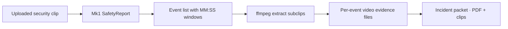

# Workplace Injury Reviewer — built on Perceptron Mk1

## Intro

**Incident video review** is the backbone of workplace safety investigations — determining what happened, who or what was involved, whether policy was violated, and what should go on the official report. Doing it manually is slow, expensive, and inconsistent. Investigators may scrub hours of CCTV to find a few seconds of relevance, then transcribe observations into forms that insurers, OSHA, and internal safety teams all expect in a standard shape.

This project demonstrates how a **vision-language model (VLM)** with native video understanding can compress that loop into a short, auditable workflow: upload a security clip and Perceptron's **Mk1** returns a timestamped safety analysis — events, severity, visual evidence, recommended actions — plus a **fillable Workplace Incident Report PDF** populated from the same findings.

The build composes several of Mk1's core multimodal primitives in one end-to-end flow:

- **Native video Q&A with chain-of-thought reasoning** (`question(..., reasoning=True)`)
- **Schema-constrained structured output** via `pydantic_format(SafetyReport, strict=True)` — typed events with MM:SS timestamps, severity, and a `requires_human_review` triage flag
- **Focused follow-up calls** on the highest-severity event for injury inference and on-screen date/time extraction


## Why I chose this problem

Every serious workplace — warehouses, construction sites, offices — already has cameras. What they lack is a fast path from **footage → documented incident**. Today that path is almost entirely human:

1. A supervisor or safety officer gets alerted.
2. Someone searches DVR/NVR footage for the relevant window.
3. They watch repeatedly, take notes, and fill out a paper or PDF incident form.
4. Compliance, insurance, and operations each want the same facts in slightly different packaging.

The existing tooling splits into two camps and misses the middle:

- **Traditional VMS / CCTV platforms** — Milestone, Genetec, Verkada, etc. Excellent at storage, playback, and motion triggers. They detect *that something moved* but do not reason about *what safety violation occurred* or draft narrative fields for a report.
- **Manual review + generic form software** — SharePoint forms, PDF templates, EHS suites. The human still does all visual interpretation and wording.

Neither answers a natural-language question or produces a structured, timestamped event list tied to visual evidence. That gap is where a **VLM with semantic video understanding and structured output** belongs.

The audience spans three tiers with the same underlying primitive:

| Tier | Who | Motion |
|------|-----|--------|
| **Operational** | Warehouse, manufacturing, and construction safety teams | Faster first-pass triage after near-misses and injuries |
| **Compliance** | EHS, risk, and insurance investigators | Consistent, evidence-linked documentation for audits and claims |
| **Platform** | VMS vendors, integrators, and enterprise AI teams | A model layer on top of existing camera infrastructure |

Worker safety, regulatory exposure, and insurance outcomes all depend on getting incident documentation right. Automating the *review and draft* step — while keeping humans in the loop for sign-off — is high leverage.

## Architecture

```mermaid
graph TD
    U[User uploads security clip]
    UI[Gradio UI on HF Space]
    U --> UI

    UI --> Prep[compress_video.prepare_video_for_upload]
    Prep -->|MP4 H.264 ≤15 MB · trim ~128s| Stream[incident_review_stream]

    Stream --> Q1["question · video + prompt<br/>reasoning=True · pydantic_format SafetyReport<br/>stream=True"]
    Q1 --> API[Perceptron Mk1 API]

    API -.SSE: reasoning.delta + text.delta + final.-> Stream

    Stream --> JSON[Structured SafetyReport JSON]
    JSON --> Map[safety_report_to_form_values]
    Map --> Q2["question · injury inference<br/>primary event timestamp range"]
    Map --> Q3["question · on-screen date/time<br/>if visible in footage"]
    Q2 --> API
    Q3 --> API
    Q2 --> PDF[ReportLab fillable PDF]
    Q3 --> PDF

    UI --> FB[👍 / 👎 feedback + optional comment]

    Stream -.FlowTrace span.-> LF[Langfuse · traces + scores]
    Q1 -.generation span.-> LF
    Q2 -.generation span.-> LF
    Q3 -.generation span.-> LF
    FB -.user-rating score.-> LF
```

**One user-facing flow (Flow A — Safety Incident Review)**, up to **three Mk1 call sites** per successful run:

1. **Primary review** — full-clip structured `SafetyReport` with reasoning.
2. **Injury enrichment** — targeted pass on the highest-severity event's time window.
3. **Datetime enrichment** — reads on-screen camera timestamps when present; leaves fields blank otherwise.

All model calls are wrapped in **Langfuse generation spans** capturing prompts, structured-output flags, text previews, and error counts. The Gradio path uses an explicit `FlowTrace` span because OpenTelemetry context does not survive Python `yield` across generator steps — a detail that matters for correct trace nesting in streaming UIs.

### Repository layout

| Module | Responsibility |
|--------|----------------|
| `app.py` | Gradio UI — upload, sample clips, streaming results, PDF download, feedback |
| `analyze.py` | Core Flow A orchestration (prep → model → PDF attach) |
| `models.py` | Pydantic `SafetyReport` / `SafetyEvent` schemas |
| `streaming.py` | SSE consumption, transport-error fallback, `FlowUpdate` dataclass |
| `incident_report.py` | JSON → form mapping, enrichment prompts, ReportLab PDF generation |
| `compress_video.py` | ffmpeg/ffprobe convert, compress, trim for API limits |
| `tracing.py` | Langfuse init, spans, session propagation, user scores |
| `safety_check.py` | Headless CLI entry point |

Deploy artifacts: `requirements.txt`, `apt.txt` (ffmpeg on Hugging Face Spaces), `.env.example`.

## Methodology

The build followed a practical sequence from API call to production surface.

**1. Define the output contract first.** Before touching UI code, the `SafetyReport` Pydantic schema locked down what "done" looks like: `overall_summary`, a list of `SafetyEvent` objects (type, severity, MM:SS window, description, visual evidence, recommended action), and `requires_human_review` for triage. Field descriptions double as prompt guidance for Mk1 via `pydantic_format(..., strict=True)`.

**2. Compression and conversion pipeline.** Raw security footage is often MOV from a phone, AVI from a DVR export, or hundreds of megabytes long. Mk1's request body cap is 20 MB; this app targets **15 MB** with headroom. `compress_video.py` wraps ffmpeg to:

- Convert non-MP4 / non-H.264 sources to MP4 (H.264/AAC)
- Progressively raise CRF and downscale (720p → 480p) until under the cap
- Auto-trim to **~128 seconds** when clips are long and oversized — aligned with how much footage Mk1 meaningfully samples

The Gradio app calls `prepare_video_for_upload` automatically on Analyze; the CLI script is for manual prep.

**3. Primary Mk1 capability: structured incident review.** One focused prompt asks for every observable safety event, near-miss, or policy violation — with an explicit constraint to **cite only what is directly visible on camera**. Chain-of-thought reasoning is enabled so reviewers (and Langfuse traces) can audit *why* the model flagged each event.

**4. PDF workflow as a second layer — not a second model architecture.** Rather than asking Mk1 to emit PDF bytes, the app:

- Maps structured JSON to workplace form fields heuristically (activity before incident, narrative description, equipment regex, injury yes/no from keyword + severity cues)
- Runs **two narrow follow-up video questions** on the primary (highest-severity) event for fields that need pixel-level verification: likely injuries and on-screen date/time
- Renders a **fillable AcroForm PDF** programmatically with ReportLab so safety managers can edit before filing

**5. Streaming Gradio app on Hugging Face Spaces.** `incident_review_stream` is a generator that yields `FlowUpdate` objects as SSE events arrive — reasoning markdown, in-progress JSON text, final structured output, then PDF path. `streaming.py` handles `reasoning.delta` / `text.delta` / `final` events and falls back to a non-streaming `question()` call when the SSE connection resets.

**6. LLMOps observability and evaluation loop.** Langfuse captures:

- **Flow span** (`flow-a-incident-review`) — video metadata only (no raw bytes), structured output, event counts
- **Generation spans** (`perceptron-mk1`) — per model call
- **Session grouping** via Gradio `session_hash`
- **User feedback** — boolean `user-rating` score with optional comment, linked to the same trace ID

This enables satisfaction dashboards, low-rated trace review, annotation queues, and future regression datasets when prompts or schemas change.

## What the app produces

For each analyzed clip, a reviewer gets:

**Structured JSON safety report**

```json
{
  "summary": "…",
  "events": [
    {
      "event_type": "forklift_near_miss",
      "severity": "high",
      "start_time": "00:42",
      "end_time": "00:51",
      "description": "…",
      "visual_evidence": "…",
      "recommended_action": "…"
    }
  ],
  "requires_human_review": true
}
```

**Workplace Incident Report PDF** — editable fields including date/time of incident, activity before incident, incident narrative, injury checkboxes, injury description, and objects/substances involved.

## Who it is useful for

- Warehouse and logistics operators
- Manufacturing facilities
- Construction companies
- Workplace safety and EHS teams
- Insurance investigators
- Compliance and risk management organizations

## Current limitations

- **Upload size** — must end up as MP4 under ~15 MB; longer sources are trimmed to ~2 minutes.
- **Single-clip scope** — no multi-camera sync or hours-long archive search in this demo.
- **Human sign-off required** — `requires_human_review` defaults true for ambiguous or high-severity cases; the PDF is a draft, not a legal filing.
- **Datetime fields** — populated only when an on-screen timestamp is visible; otherwise left blank for manual entry.
- **Langfuse optional** — tracing and feedback require `LANGFUSE_PUBLIC_KEY` / `LANGFUSE_SECRET_KEY`.


## Next steps

The most valuable extensions move from "analyze one uploaded clip" to "operate over a facility's footage backlog."

**1. Temporal clip export at event timestamps.** The structured report already carries MM:SS windows per event. Pair Mk1's analysis with an **ffmpeg harness** (or MCP server) to cut evidentiary subclips for each flagged event and attach them to the PDF or case file — the same composition pattern as grounded `<clip>` tags, but driven off schema timestamps.



**2. Agentic search over long archives.** An orchestrator could decompose *"find all forklift pedestrian conflicts last Tuesday"* into parallel Mk1 calls over candidate segments, verify reasoning against returned events, and escalate only high-severity hits to human review — turning the current single-clip demo into a **semantic search layer** on top of NVR exports.

**3. VMS and EHS integrations.** Webhook or MCP adapters that pull clips from Verkada/Genetec/Milestone by camera ID and time range, push completed reports into ServiceNow, Enablon, or insurer portals.


**5. Jurisdiction-specific form variants.** OSHA 301, WSIB, state workers' comp layouts — same `SafetyReport` intermediate representation, different PDF templates.

This is the architectural shape that takes the demo from "a safety manager uploads a clip in a browser" to "an intelligence layer every site runs over its existing camera investment." Same Mk1 primitives — native video understanding, structured output, chain-of-thought reasoning, and focused multi-pass Q&A — with orchestration and downstream tooling matched to how incidents are actually investigated.
